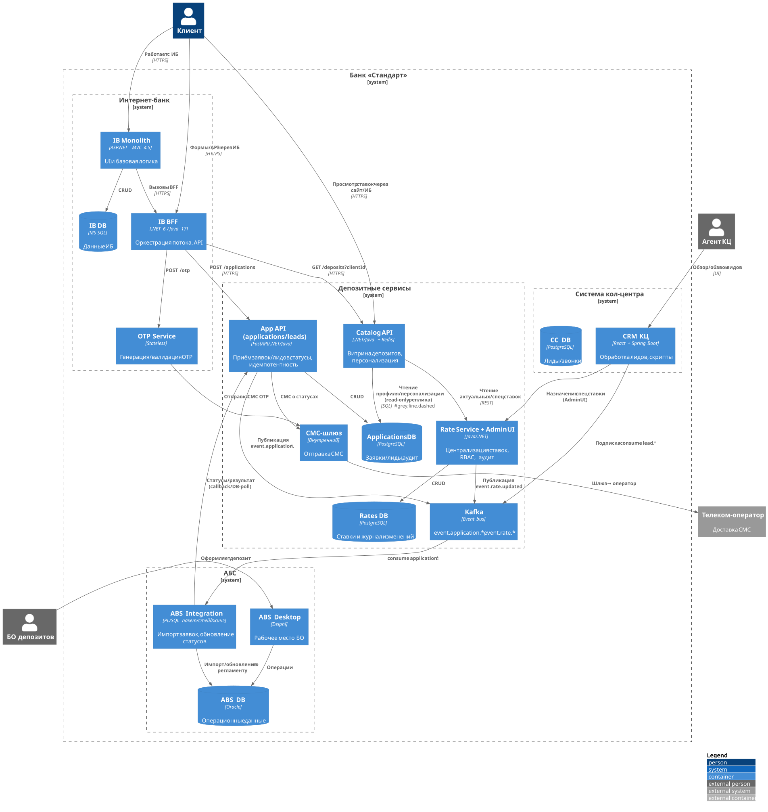

### ADR: Открытие депозитов онлайн (MVP)

### **Название задачи:** MVP открытия депозитов в интернет-банке и на сайте с централизацией ставок

### **Автор:** Архитектурная группа, Команда ИТ

### **Дата:** 2025-10-26

### **Функциональные требования**

|  №  | Действующие лица или системы                  | Use Case                                         | Описание                                                                                                                            |
| :-: | :-------------------------------------------- | :----------------------------------------------- | :---------------------------------------------------------------------------------------------------------------------------------- |
| UC1 | Клиент, Сайт, Catalog API                     | Просмотр перечня депозитов на сайте              | Клиент открывает страницу «Депозиты». Сайт вызывает Catalog API → получает актуальные ставки из Сервиса ставок. (F2, +R1)           |
| UC2 | Клиент, Сайт, Lead API, КЦ                    | Заявка на депозит с сайта                        | Клиент заполняет ФИО и телефон. Сайт шифрует трафик и отправляет в Lead API. КЦ получает лид и связывается. (F1,F3,F8)              |
| UC3 | Агент КЦ, Admin UI ставок, Сервис ставок      | Назначение спецусловий                           | Агент КЦ видит лид, при необходимости фиксирует спецставку через Admin UI. Аудит изменений. (F3,F9,+R1)                             |
| UC4 | Клиент, ИБ, BFF, Catalog API                  | Просмотр депозитов в ИБ с персональными ставками | Клиент авторизован в ИБ. ИБ BFF запрашивает персонализированные ставки у Catalog API с учётом профиля клиента из кэша. (F4, P3, R3) |
| UC5 | Клиент, ИБ, BFF, OTP, SMS-шлюз                | Подтверждение заявки СМС-кодом                   | Инициируется OTP через существующий СМС-шлюз. Клиент вводит код. BFF валидирует через OTP-сервис. (F6, +R3, R6, P2)                 |
| UC6 | Клиент, ИБ, App API, Kafka, БО депозитов, АБС | Подача заявки в ИБ                               | BFF создаёт заявку в App API → событие в Kafka → задача для БО. Прямых онлайн-вызовов АБС нет. (F5,F7,R3,R4)                        |
| UC7 | БО депозитов, АБС, App API, SMS-шлюз          | Обработка заявки и открытие депозита             | БО оформляет депозит в АБС, статус возвращается в App API, клиент получает СМС «ставка подтверждена/депозит открыт». (F7,F8,R5)     |
| UC8 | Все, Obs Stack                                | Аудит, наблюдаемость, SLO                        | Логи, трассировки, метрики. Журнал всех действий по ставкам/заявкам. (R1,R5,S3,S4)                                                  |

### **Нефункциональные требования**

|   №   | Требование                                                                                  |
| :---: | :------------------------------------------------------------------------------------------ |
|  NFR1 | TLS 1.2+ для сайта/ИБ ↔ бэкенды. Маскирование PII в логах. (R6,R7)                          |
|  NFR2 | Доступность 99.9% в месяц для ИБ и фронт-сервисов. DR-переключение в резервный ЦОД. (R1,R2) |
|  NFR3 | Изоляция АБС: отсутствие прямых онлайн-вызовов из ИБ. (R3,+R4)                              |
|  NFR4 | p95: списки ≤500 мс, создание заявки ≤800 мс, доставка OTP ≤30 с. (P1,P2)                   |
|  NFR5 | Кэш ставок и справочников, инвалидация по событию. (P3)                                     |
|  NFR6 | Горизонтальное масштабирование фронт-сервисов, rolling/blue-green. (P4,S4)                  |
|  NFR7 | Идемпотентность и дедупликация заявок/сообщений. (R4)                                       |
|  NFR8 | Централизованный сервис ставок с аудитом, версионирование API. (F9,S5,+R1)                  |
|  NFR9 | Наблюдаемость: Prometheus/Grafana, OTel трассировки, ADR/API-контракты. (S2,S3)             |
| NFR10 | Технологический стек: MS SQL, Oracle, Java/.NET, Python; Kafka как брокер. (S1,+R2)         |

### **Решение**

Диаграммы в отдельных файлах PlantUML:

* Контекст: `c4_context_deposits_mvp.puml`
* Контейнеры: `c4_containers_deposits_mvp.puml`

Ключевая логика:

1. **Сервис ставок**: централизованное хранилище ставок и спецусловий. Admin UI для КЦ/БО. Кэш на чтение. Публикация событий «rate.updated» в Kafka. (F2,F3,F4,F9,+R1)
2. **Catalog API**: единая точка чтения продуктовой витрины для Сайта и ИБ. Персонализация в ИБ на основе профиля клиента из read-only кэша профилей (реплика/ETL из АБС), без онлайн-вызовов в АБС. (F4,R3,P3)
3. **ИБ BFF**: внешний оркестратор потока открытия депозитов без изменения ядра ИБ. Реализует формы, OTP-флоу, создание заявок. (F5,F6,+R3,S4)
4. **OTP-сервис**: stateless, работает через текущий СМС-шлюз. (F6,P2,R6)
5. **App API (Deposit Applications)**: приём и хранение заявок, идемпотентность, аудит. Публикует события в Kafka для БО-воркфлоу. (F5,F7,R4,R5)
6. **БО-воркер**: потребляет события, формирует задачу для БО. Интегрируется с АБС через согласованный импорт (PL/SQL пакет/стейджинг). Онлайн-нагрузка на АБС исключена. (F7,R3,+R4)
7. **Статусы и уведомления**: изменения статуса в App API → СМС через шлюз. (F8)
8. **Наблюдаемость и SLO**: метрики latency/throughput/ошибок, трассировки по сквозным корреляторам, алерты. (R1,S3)
9. **CI/CD и отказоустойчивость**: фронт-сервисы масштабируются горизонтально, rolling/blue-green, DR-план. (R2,P4,S4)

#### **C4-Контекст**

#### **C4-Контейнеры**

#### Технологии

* **BFF, Catalog API**: .NET 6 или Java 17, REST, OpenAPI, Redis-кэш.
* **Сервис ставок, Admin UI**: Java/.NET + PostgreSQL, аудит в append-only таблицах.
* **App API**: Python FastAPI или Java/.NET + PostgreSQL, Kafka для событий.
* **OTP**: stateless сервис + существующий СМС-шлюз.
* **АБС интеграция**: PL/SQL пакет для импорта/изменений, файловый/DB-стейджинг по регламенту.
* **Безопасность**: TLS, mTLS внутр. контур, PII-masking в логах, RBAC.

### **Альтернативы**

1. Прямые REST-вызовы ИБ → АБС.
   Минусы: нарушает изоляцию, риск перегрузки АБС, высокий технический долг. (R3,+R4)

2. Реализация всего внутри ядра ИБ.
   Минусы: завязка на подрядчика, длинные циклы релизов, нарушение +R3.

3. Ставки через XLS с импортом по расписанию.
   Минусы: несогласованность, отсутствие аудита, риск ошибок. Противоречит +R1, F2,F9.

4. Очередь RabbitMQ вместо Kafka.
   Минусы: не соответствует +R2 предпочтению; допустимо как временный мост для ИБ.

**Недостатки, ограничения, риски**

* Персонализация в ИБ зависит от качества репликации профиля клиента из АБС. Возможна задержка обновления сегмента.
* Ручной этап в БО остаётся в MVP, SLA «1 день» зависит от дисциплины обработки.
* Необходимы согласованные интерфейсы импорта в АБС и регламент изменений.
* Требуется единая дизайн-система и BFF-страницы под домен ИБ без изменений ядра.
* Комплаенс ПДн: контроль маскирования в логах и разграничение доступа к Admin UI ставок.
