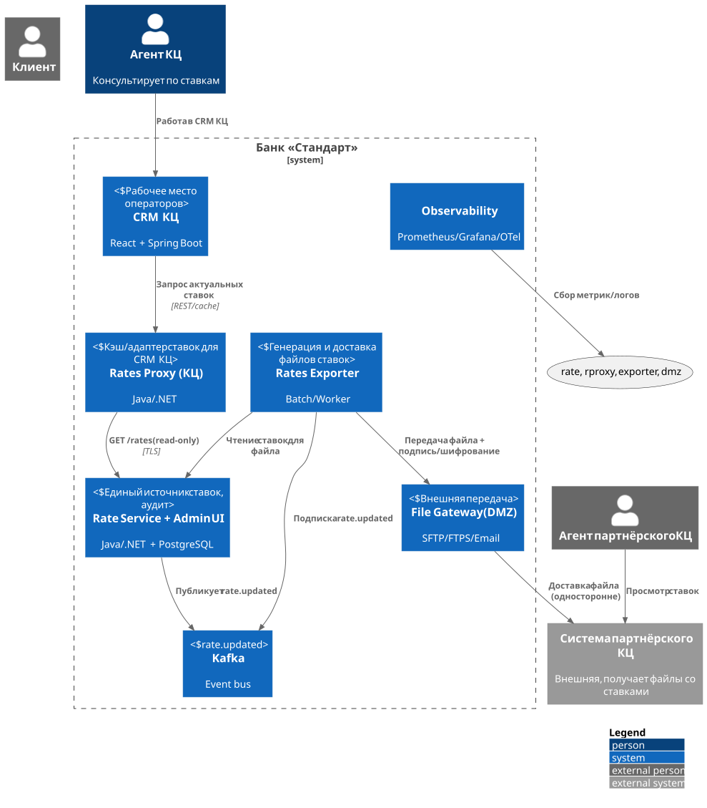
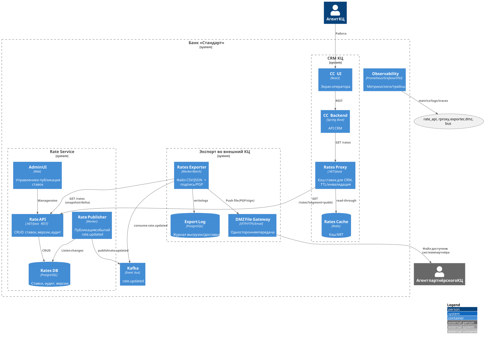
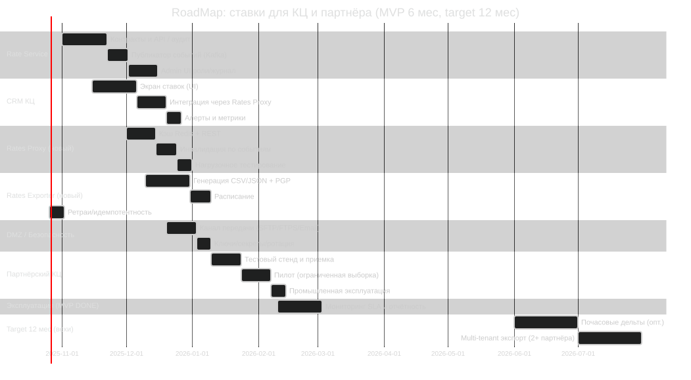

### **Название задачи:** Передача и использование депозитных ставок в кол-центрах (включая партнёрский). MVP и целевая модель.

### **Автор:** Архитектурная группа, Команда ИТ

### **Дата:** 2025-10-26

---

### **Функциональные требования (Use Cases)**

|  №  | Действующие лица/системы       | Use Case                  | Описание                                                                                                             |
| :-: | :----------------------------- | :------------------------ | :------------------------------------------------------------------------------------------------------------------- |
| UC1 | Агент КЦ, CRM КЦ, Rate Service | Просмотр текущих ставок   | Агент КЦ видит актуальные публичные ставки в интерфейсе КЦ. Обновление без перезагрузки экрана.                      |
| UC2 | Агент КЦ, Admin UI ставок      | Назначение спецставки     | По регламенту может применить спецусловия. Все изменения — через Admin UI с аудитом.                                 |
| UC3 | Партнёрский КЦ, Rates Exporter | Получение файла ставок    | Партнёр получает файл с актуальными ставками по расписанию и/или при изменении. Нет вызовов API со стороны партнёра. |
| UC4 | Rate Manager, Rate Service     | Публикация ставок         | Менеджер меняет ставку в Admin UI. Сервис публикует событие `rate.updated`.                                          |
| UC5 | CRM КЦ, Rates Proxy            | NRT-обновление ставок     | КЦ подписан на события или кэширует через REST. SLA обновления ≤5 мин.                                               |
| UC6 | Rates Exporter → Партнёр       | Безопасная передача файла | Банковский сервис формирует CSV/JSON + PGP-подпись, передаёт по защищённому каналу, ведёт аудит доставки.            |
| UC7 | Наблюдаемость                  | Аудит и мониторинг        | Логи изменений ставок, журналы выгрузок/доставки, метрики задержек и ошибок.                                         |

---

### **Нефункциональные требования**

|   №  | Требование                                                                                                                                        |
| :--: | :------------------------------------------------------------------------------------------------------------------------------------------------ |
| NFR1 | Единый источник истины по ставкам — Rate Service с аудитом версий.                                                                                |
| NFR2 | Внутренний КЦ: актуализация ставок ≤5 мин от изменения.                                                                                           |
| NFR3 | Партнёрский КЦ: полнота данных. Ежедневный полный снапшот 07:00, инкрементальные дельты по событию, но не чаще 1/час.                             |
| NFR4 | Безопасность: TLS внутри периметра; для внешнего канала — SFTP/FTPS исходящий из DMZ или PGP-зашифрованный email. Подпись и контроль целостности. |
| NFR5 | Контракты данных: версионирование схемы (v1, v1.1), обратная совместимость, семантика полей.                                                      |
| NFR6 | Идемпотентность выгрузок, повторная доставка при сбое, дедупликация у получателя.                                                                 |
| NFR7 | Наблюдаемость: Prometheus/Grafana, OTel трассировки для REST/экспорта, алерты p95 задержек.                                                       |
| NFR8 | Разделение ролей: просмотр в КЦ read-only; изменения ставок только в Admin UI ставок.                                                             |
| NFR9 | Отказоустойчивость: экспорт повторяет попытки, хранит последние N файлов, DR-канал передачи.                                                      |

---

### **Решение**

Диаграммы — C4-PlantUML.

**`c4_context_rates_cc.puml`**

**`c4_containers_rates_cc.puml`**

**Логика выбора:**

* Истина по ставкам одна — Rate Service. Внутренний КЦ читает через Proxy с кэшем. NRT через события.
* Партнёру без API даём файловую поставку: полный снапшот ежедневно + дельты по событию, с подписью и шифрованием.
* Односторонний исходящий канал через DMZ снижает риски и упрощает доступ.
* Контракты версионируем. Идемпотентность и наблюдаемость обязательны.

---

### **Альтернативы**

1. Прямые REST-вызовы партнёра к Rate API.
   Минусы: нет такой возможности; усложнение периметра и аутентификации.

2. Реплика БД ставок в КЦ.
   Минусы: сложнее поддерживать схему и безопасность; риск рассинхронизации.

3. Email без шифрования.
   Минусы: комплаенс и риск утечки.

4. Только ежедневный файл без дельт.
   Минусы: устаревание данных, несоответствие NFR по актуальности.

---

### **Недостатки, ограничения, риски**

* Партнёр получает данные пакетно. Между выгрузками возможна задержка до часа.
* Требуется организационный обмен PGP-ключами и настройка DMZ.
* Отказ канала передачи потребует ретраев и ручного контроля.
* При изменении схемы файлов нужна миграция у партнёра.

---

## `Task4/system-tasks.md` — крупные задачи по системам

**Rate Service**

* Добавить `GET /rates` с фильтрами и версиями.
* Аудит изменений, причины и инициатор.
* Worker `rate.publisher` → Kafka `rate.updated`.
* Admin UI: роли, журнал аудита.

**CRM КЦ**

* Экран ставок в UI.
* Backend: интеграция с Rates Proxy, кеш TTL + инвалидация по событию.
* RBAC: только чтение.

**Rates Proxy (новый)**

* Кэш Redis, fall-back к Rate API.
* Подписка на `rate.updated` для инвалидации.
* Метрики p95, ошибки, кэш-hit.

**Rates Exporter (новый)**

* Генерация CSV/JSON v1 + контрольная сумма.
* PGP-подпись/шифрование, ретраи, идемпотентность.
* Полный снапшот 07:00, дельты по событию, но не чаще 1/час.
* Логи доставки и реестр отправок.

**DMZ File Gateway**

* Исходящий канал: SFTP/FTPS или защищённый email.
* Секреты/ключи, ротация, мониторинг.

**Observability/DevOps**

* Дашборды для latency, freshness, delivery rate.
* Алерты на просрочку выгрузок и ошибки передачи.
* CI/CD, секрет-менеджмент, runbooks.

**Документы**

* Data Contract v1 (CSV/JSON), примеры, словарь полей.
* Регламент инцидентов и эскалаций.

---

## `Task4/roadmap-mermaid.md` — RoadMap (6 месяцев MVP + ориентиры на год)

**Итог:** внутренний КЦ получает ставки NRT через Proxy; партнёр — файлы с контролем доставки и аудитом. Централизация ставок сохраняется.
