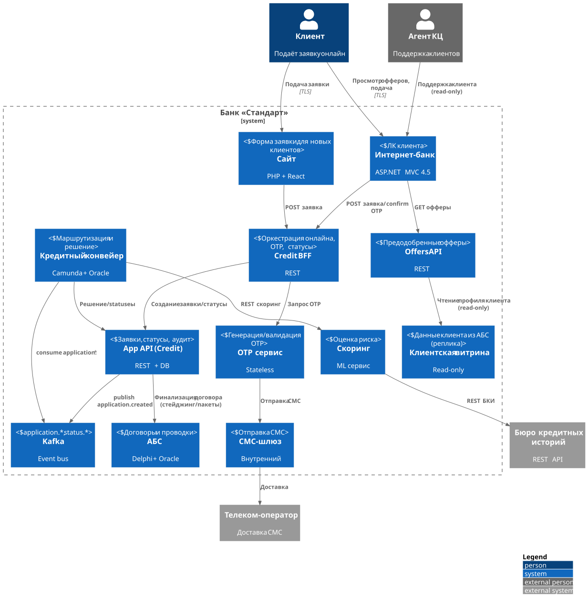
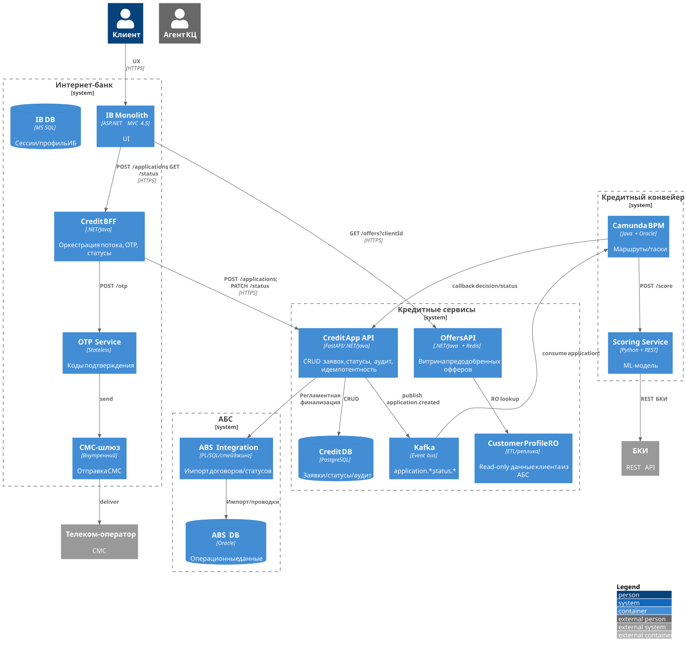

### **Название задачи:** Онлайн-заявка на кредит за 1 год после MVP

### **Автор:** Архитектурная группа, Команда ИТ

### **Дата:** 2025-10-26

## Функциональные требования (Use Cases)

|   №  | Действующие лица / системы      | Use Case                        | Описание                                                                            |
| :--: | :------------------------------ | :------------------------------ | :---------------------------------------------------------------------------------- |
|  UC1 | Клиент, ИБ, Offers API          | Просмотр предодобренных офферов | Авторизованный клиент видит лимит/ставку и параметры. Повторный скоринг при подаче. |
|  UC2 | Клиент, ИБ, Credit BFF          | Подача онлайн-заявки в ИБ       | Ввод суммы/срока, подтверждение ПДн, согласие на БКИ. Заявка создана идемпотентно.  |
|  UC3 | Клиент, Сайт, Credit BFF        | Подача заявки с сайта           | Для новых клиентов: ФИО+телефон+паспорт опц., KYC офлайн.                           |
|  UC4 | Credit BFF, OTP, СМС-шлюз       | Подтверждение заявки СМС-кодом  | 2FA без доработки монолита ИБ.                                                      |
|  UC5 | Credit BFF, Конвейер (Camunda)  | Отправка заявки в Конвейер      | Прямой маршрут Site/ИБ → Конвейер, минуя онлайн-вызовы АБС.                         |
|  UC6 | Конвейер, Скоринг, БКИ          | Скоринг заявки                  | Онлайновый запрос в БКИ, агрегация внутренних данных по клиенту из витрины/реплики. |
|  UC7 | Конвейер, Решение               | Принятие решения ≤1 день        | Автомат/операционист по правилам.                                                   |
|  UC8 | Конвейер, АБС                   | Финализация                     | Передача финального статуса/договоров в АБС регламентным интерфейсом.               |
|  UC9 | Клиент, ИБ/Сайт, App Status API | Отслеживание статуса            | Клиент видит статусы, получает СМС-уведомления.                                     |
| UC10 | КЦ, Status/Offers API           | Поддержка по телефону           | Агент видит статусы и публичные параметры оффера read-only.                         |

## Нефункциональные и архитектурно значимые требования

* Доступность фронтов и API: 99.9%/мес. DR-переключение.
* Безопасность: TLS 1.2+, mTLS внутри, маскирование PII в логах, аудит всех действий.
* Изоляция АБС: нет прямых онлайн-вызовов ИБ→АБС. Интеграция через стейджинг/пакеты.
* SLA: создание заявки p95 ≤ 800 мс; выдача OTP p95 ≤ 30 с; показ офферов p95 ≤ 500 мс.
* Событийность: Kafka для статусов и инвалидаций кэша. Идемпотентность и дедупликация.
* Наблюдаемость: Prometheus/Grafana, OTel трассировки, кореляция по request-id.
* Версионирование API и контрактов, обратная совместимость.
* БКИ: лимиты запросов, ретраи, тайм-ауты, деградация в асинхрон.
* Данные клиента для предодобренных — из витрины/реплики профиля, не из онлайна АБС.
* Соответствие 152-ФЗ и внутреннему комплаенсу.

## Решение

Диаграммы — C4-PlantUML. В контексте и контейнерах оставлены только элементы, влияющие на изменения.

### C4-context

### C4-containers

## Альтернативы

1. Прямые онлайн-вызовы ИБ → АБС для создания заявки.
   Минусы: нарушает изоляцию, риск нагрузки на АБС, зависимость от десктопной логики.

2. Оставить batch ABSDB↔Конвейер раз в сутки.
   Минусы: не выполняет «решение ≤ 1 день» при высокой очереди; хуже UX.

3. Реализовать весь поток в монолите ИБ.
   Минусы: зависимость от вендора, долгий релиз, конфликт с 2FA-обходом.

4. Партнёрский внешний скоринг вместо собственного.
   Минусы: комплаенс ПДн, стоимость, потеря контроля над моделью и фичами.

## Ограничения решения

* АБС остаётся offline-интегрируемой системой. Финализация только через стейджинг/пакеты.
* Для новых клиентов с сайта KYC офлайн; без него возможна только предварительная оценка.
* Ограничения БКИ по частоте и доступности. Нужны ретраи и деградация в асинхронные статусы.
* Предодобренные офферы зависят от качества и свежести витрины профиля. Возможна задержка репликации.
* Без доработки ядра ИБ OTP выполняется через внешний BFF/сервис.
* Требуется строгий аудит и контроль доступа к ПДн на всех слоях.
